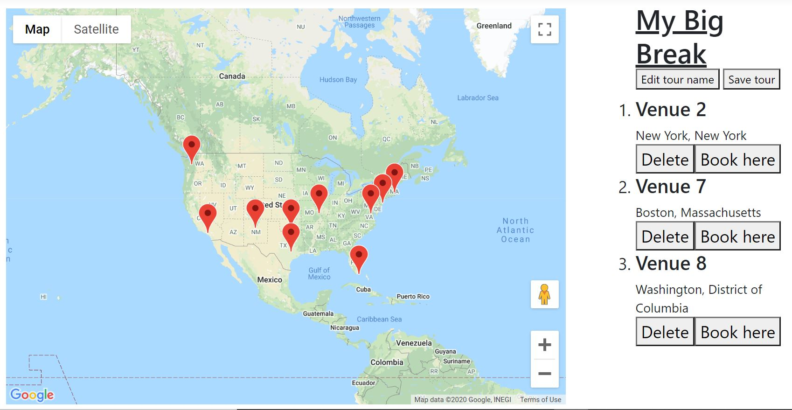

# Hit The Road

Hit The Road is a full-stack travel-planning and messaging web application for bands looking to book tours and music venues looking to better manage booking inquiries. The app was designed with an ASP.NET MVC architecture.

## Purpose

I have a lot of friends who are musicians, and the one thing they agreed could be improved with technology is the process of booking a tour.
My friends who run music venues also said the booking inquiry process could desperately use some standardization and centralization. I thought a map and messaging system would remove a lot of the friction from those processes on both sides.

## Features

#### Band

When a band logs in, they will be shown a dashboard that tells them if they have any unread messages, and lets them navigate to the tour-planning map page, the list of their saved tours, the message center, and the text list of all registered venues.

#### Venue

When a venue logs in, they will be shown a dashboard that tells them if they have any unread messages, and lets them navigate to message center.

